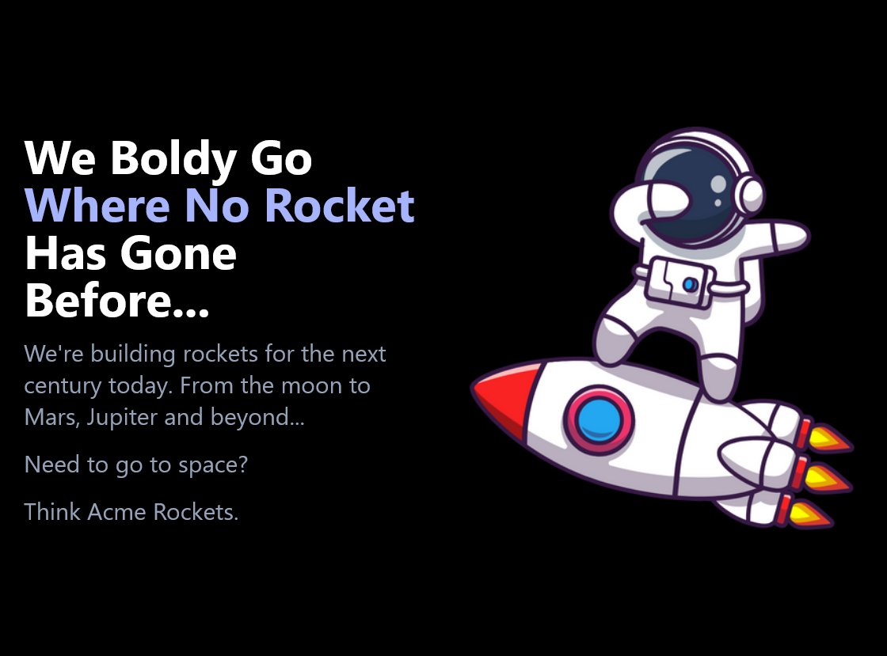

## Table of contents

- [Overview](#overview)
  - [The challenge](#the-challenge)
  - [Screenshot](#screenshot)
  - [Links](#links)
- [My process](#my-process)
  - [Built with](#built-with)
  - [What I learned](#what-i-learned)
  - [Continued development](#continued-development)
  - [Useful resources](#useful-resources)
- [Author](#author)

## Overview

### The challenge
Build a landing page for Acme Rockets. 

Users should be able to:

- View the optimal layout for the site depending on their device's screen size
- Interact with navigation items

### Screenshot



### Links

- Solution URL: [GitHub](https://github.com/snelson-seattle/tailwindcss-landing-page)
- Live Site URL: [Not yet deployed]()

## My process

### Built with

- Semantic HTML5 markup
- Tailwind CSS
- Mobile-first workflow
- [React](https://reactjs.org/) - JS library

### What I learned

I did this project primarily to practice using Tailwind CSS with React JS. I learned how to integrate Tailwind into a React project and how to apply Tailwind classes to my components to easily add CSS while I am building them. I wanted to add an animation to the mobile menu, and I had to learn how to create custom CSS animations in Tailwind by editing the tailwind.config.js file. See below:

```js
theme: {
    extend: {
      keyframes: {
        "open-menu": {
          "0%": {transform: "scaleY(0)"},
          "80%": {transform: "scaleY(1.2)"},
          "100%": {transform: "scaleY(1)"},          
        }
      },
      animation: {
        "open-menu": "open-menu 0.5s ease-in-out forwards",
      }
    },
  },
```

### Continued development

Right now the is just a landing page. In the future it would be nice to add a backend, and make it a functioning E-Commerce site.

### Useful resources

- [Tailwind CSS Docs](https://tailwindcss.com/docs/) - The documentation is so helpful and well organized. It is easy to find the Tailwind class for exactly what you are trying to do with your CSS.

## Author
Scott E. Nelson
- Website - [www.scottenelson.dev](https://scottenelson.dev)
- GitHub - [snelson-seattle](https://github.com/snelson-seattle)
